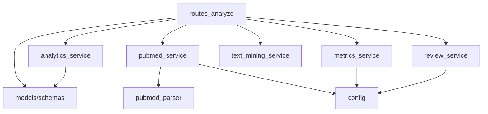
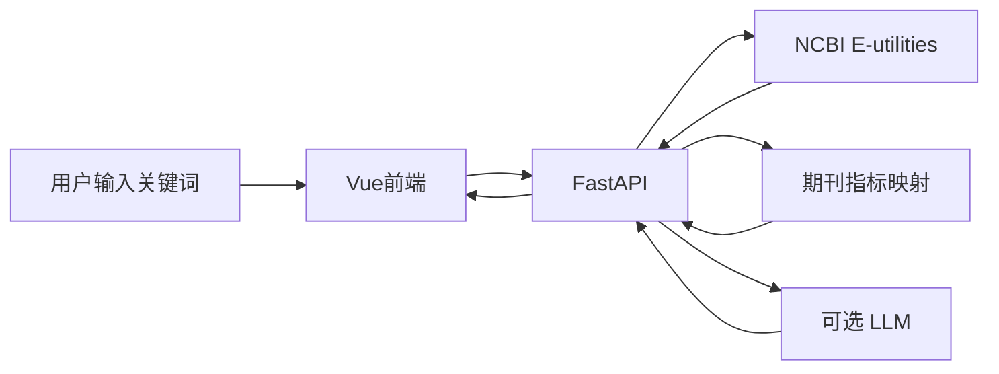

# PubMed 文献分析网页 Demo 实现计划

## 背景与约束

- **工作区现状**：[web_demo](D:\13056\web_demo) 已有 [.cursor/rules/python_rule.mdc](D:\13056\web_demo.cursor\rules\python_rule.mdc)、[.cursor/rules/vue_rule.mdc](D:\13056\web_demo.cursor\rules\vue_rule.mdc)；**本 Demo 前端按最简原则实现**，不强制启用 `vue_rule` 中的 Router/Pinia/多模块目录，后续可再对齐扩展。
- **PubMed 能力边界**：NCBI E-utilities（`esearch` + `efetch`）提供题录、摘要、期刊名、ISSN、发表年等；**不包含影响因子（IF）与 JCR 分区（Q1–Q4）**。这两项必须通过**本地映射表**或**第三方开放指标**近似实现（见下文「期刊指标策略」）。
- **你的选择**：综述采用 **无密钥可跑通（模板/占位）+ 环境变量配置后真实 LLM 生成**。

---

## 推荐技术栈


| 层级  | 选型                                                                                                  | 说明                                                                                                                                                                                                                                       |
| --- | --------------------------------------------------------------------------------------------------- | ---------------------------------------------------------------------------------------------------------------------------------------------------------------------------------------------------------------------------------------- |
| 后端  | Python 3.10+、FastAPI、`httpx`/`requests`、可选 `lxml` 解析 XML                                            | 规避浏览器直连 PubMed 的 CORS；统一限流与 LLM 密钥                                                                                                                                                                                                       |
| 前端  | **Vue 3 + Vite + TypeScript**（[Composition API](https://vuejs.org/)，`<script setup>`）               | **最简原则**：单页、**不引入 vue-router、不引入 Pinia**；状态用 `ref`/`reactive` + 可选单一 `composables/useAnalyze.ts`；图表 [ECharts](https://echarts.apache.org/)（`vue-echarts` 或直接 `echarts`+`ref`）；词云 [wordcloud2](https://github.com/timdream/wordcloud2.js) |
| 联调  | Vite `server.proxy` 将 `/api` 转发至 `http://127.0.0.1:8000`；生产构建 `npm run build` 后由 FastAPI 挂载 `dist/` | 开发时双进程：`uvicorn` + `npm run dev`；`.env.development` 中 `VITE_API_BASE` 可为空（走同源代理）                                                                                                                                                         |
| 配置  | 后端 `.env`：`NCBI_API_KEY`、`LLM_`*；前端 `VITE_`* 仅非敏感项                                                  | 无 LLM 密钥时综述为模板                                                                                                                                                                                                                           |


按你的规则：**某目录下脚本/源码文件超过 1 个时，该目录需增加说明用 MD**（完成情况、修改情况、功能），计划在 `backend/`、`frontend/`、`data/` 中落实。

---

## 规范工作流程（从协作到交付）

以下为固定顺序，避免返工；每一步完成后再进入下一步。


| 阶段         | 内容                                                              | 产出物                              |
| ---------- | --------------------------------------------------------------- | -------------------------------- |
| W0 范围冻结    | 对照笔试要求列出必做/选做清单（检索、四项分析、UI、综述策略）                                | 一页功能 checklist（可写在各目录 README 顶部） |
| W1 环境      | Python 3.10+ 虚拟环境、`requirements.txt`、`.env.example`（不写真实密钥）     | 可复现安装命令                          |
| W2 契约先行    | 定义 `POST /api/analyze` 的请求/响应 JSON（Pydantic `schemas`），前后端对齐字段名 | OpenAPI 可浏览、`schemas.py`         |
| W3 数据层     | PubMed 仅负责「拉取与解析」；指标仅负责「加载与查询」                                  | 单元测试或脚本断言解析样例 XML                |
| W4 领域层     | 统计、Top100、词频、综述拼装与 LLM 调用互不混在路由里                                | `services/`* 可单独 import 测试       |
| W5 集成      | FastAPI 路由薄封装，统一异常与 HTTP 状态码                                    | 端到端：curl 或 Thunder Client 通      |
| W6 前端      | Vue `npm run dev` + FastAPI 并行；Vite 代理 `/api`；先表格再图表            | 单页可用                             |
| W7 体验与诚实标注 | Loading/空态/错误；UI 标明 IF/Q 来源为本地表                                 | 可演示录像级稳定                         |
| W8 文档      | 多文件目录补 **README.md**（完成情况、修改记录、文件说明）                            | 符合你的目录规则                         |


**日常循环（小步）**：改契约 → 改后端序列化 → 改前端取值 → 浏览器验证。

---

## 确定的项目目录结构

仓库根：`D:\13056\web_demo\`（下表路径均相对根目录）。

```text
web_demo/
├── .env.example                 # NCBI_API_KEY、LLM_* 占位说明
├── data/
│   ├── README.md                # 期刊指标文件说明、数据来源与覆盖范围
│   └── journal_metrics.json     # ISSN/规范化刊名 → IF、Q1–Q4
├── backend/
│   ├── README.md                # 后端模块说明、完成情况、修改记录
│   ├── requirements.txt
│   └── app/
│       ├── __init__.py
│       ├── main.py              # FastAPI 实例、CORS、挂载 frontend 静态目录、路由 include
│       ├── config.py            # pydantic-settings：超时、路径、LLM 开关
│       ├── api/
│       │   ├── __init__.py
│       │   └── routes_analyze.py # POST /api/analyze（或 /api/search）
│       ├── models/
│       │   ├── __init__.py
│       │   └── schemas.py       # 请求体、Article、Stats、ReviewResult 等
│       └── services/
│           ├── __init__.py
│           ├── pubmed_service.py    # 编排 esearch + efetch
│           ├── pubmed_parser.py     # XML → 结构化记录（可纯函数）
│           ├── metrics_service.py   # 加载 journal_metrics、ISSN/刊名匹配
│           ├── analytics_service.py # 年分布、分区计数、IF 描述统计、近5年 Top100
│           ├── text_mining_service.py # 词频、停用词、研究方向短语
│           └── review_service.py    # 模板综述 + 可选 OpenAI 兼容调用
├── frontend/                    # Vue + Vite 工程（最简）
│   ├── README.md                # 脚本/组件分工、npm 脚本、与后端联调方式
│   ├── package.json
│   ├── vite.config.ts           # proxy: /api -> 8000，alias @ -> src
│   ├── tsconfig.json
│   ├── index.html
│   ├── .env.development         # VITE_API_BASE= 可选
│   └── src/
│       ├── main.ts              # createApp(App)
│       ├── App.vue              # 顶栏搜索 + Tab（统计|词云|Top100|综述）
│       ├── api/
│       │   └── analyze.ts       # POST /api/analyze 封装（fetch + 类型）
│       ├── composables/
│       │   └── useAnalyze.ts  # loading、error、result、runAnalyze()
│       ├── components/          # 仅拆必要子组件，避免过度抽象
│       │   ├── SearchBar.vue
│       │   ├── StatsCharts.vue  # ECharts
│       │   ├── WordCloudView.vue
│       │   ├── Top100Table.vue
│       │   └── ReviewPanel.vue
│       └── styles/
│           └── main.scss        # 全局少量变量 + App 布局
```

**说明**：

- `backend/app/` 采用包布局，与 [.cursor/rules/python_rule.mdc](D:\13056\web_demo.cursor\rules\python_rule.mdc) 一致。
- **前端最简边界**：**不装** `vue-router`、`pinia`；HTTP 优先原生 `fetch`（若需拦截器再引入 `axios`）。与 [.cursor/rules/vue_rule.mdc](D:\13056\web_demo.cursor\rules\vue_rule.mdc) 的关系：**本 Demo 取其代码风格**（`<script setup lang="ts">`、SCSS `scoped`、单引号等），**不强行铺满** `router` / `store` / `views` 全套。
- **开发**：`uvicorn`：`8000`，Vite：`5173`，浏览器只开 Vite；**生产**：`npm run build` 后 FastAPI 挂载 `frontend/dist`，API 仍为 `/api/`*。
- `main.py`：`StaticFiles` 挂 `dist` 须在 **APIRouter** 之后；开发期可仅用 CORS + Vite 代理。

---

## 模块结构（依赖方向）

只允许 **单向依赖**，禁止循环 import：




- `**routes_analyze.py**`：只做参数校验、调用 services、组装 `schemas` 响应；不写 XML 解析与业务公式。
- `**pubmed_parser.py**`：无 HTTP，便于用固定 XML 片段测试。
- `**analytics_service.py**`：输入「已带期刊字段的文章列表 + 已 JOIN 的 IF/Q」，输出统计与 Top100。

---

## 类与核心类型（建议）

以下为**最小够用**的面向对象划分；若时间极紧，可将部分类退化为模块级函数，但**文件边界**建议保持不变。


| 位置                       | 名称                                                                           | 职责                                                                                                |
| ------------------------ | ---------------------------------------------------------------------------- | ------------------------------------------------------------------------------------------------- |
| `config.py`              | `Settings(BaseSettings)`                                                     | `ncbi_api_key`、`journal_metrics_path`、`llm_api_base` 等                                            |
| `schemas.py`             | `AnalyzeRequest`、`ArticleRecord`、`CorpusStats`、`ReviewPayload` 等 Pydantic 模型 | API 契约，前后端对齐                                                                                      |
| `pubmed_service.py`      | `PubMedClient` 或 `PubMedService`                                             | 封装 `esearch`/`efetch` URL 构建、`httpx` 调用、429 重试策略（简单 sleep）                                        |
| `pubmed_parser.py`       | 函数 `parse_efetch_xml(xml: str) -> list[ArticleRecord]`                       | 解析 PMID、标题、摘要、年、ISSN、期刊名                                                                          |
| `metrics_service.py`     | `JournalMetricsRepository`                                                   | 启动时加载 JSON；方法 `lookup(issn, journal_title) -> Optional[JournalMetrics]`                           |
| `analytics_service.py`   | `AnalyticsService` 或纯函数模块                                                    | `build_year_histogram`、`quartile_counts`、`if_summary`、`top100_if_recent_years(articles, years=5)` |
| `text_mining_service.py` | `build_word_frequencies(texts) -> list[tuple[str,int]]`                      | 停用词、词频上限（如 Top 200）供词云                                                                            |
| `review_service.py`      | `ReviewService`                                                              | `render_template(stats, abstracts)`；`generate_llm(...)` 读 `Settings`                              |


**数据类**：`ArticleRecord` 与 `JournalMetrics` 可用 Pydantic `BaseModel` 或 `dataclass`；对外响应一律经 `schemas` 序列化，避免把内部解析中间态泄漏给前端。

---

## 总体数据流




---

## 1. PubMed 检索与解析

- **检索**：`esearch.fcgi`（`db=pubmed`，`retmax` 建议 ≤200 先取 ID 列表；若需「前 100 篇」用于综述，可 `retmax=100` 或先多取再筛选）。
- **详情**：`efetch.fcgi`（`rettype=abstract` 或 `medline`，解析 XML）。
- **抽取字段**：`PMID`、`Title`、`Abstract`、`Journal`、`ISSN`、`Year`、`Authors`（可选）。
- **礼貌使用**：请求间 `sleep` 或串行；若有 `NCBI_API_KEY`，可在文档中说明限额更高（约 10 次/秒）。

---

## 2. 期刊指标策略（IF + 分区 + 近 5 年 Top100）

**目标**：实现「5 年内按影响因子排序的前 100 篇」与「分区/IF 统计」。

**可行方案（Demo 推荐组合）**：

1. **主路径**：在仓库中提供 `**data/journal_metrics.json`**（或 CSV），结构示例：`issn` / 规范化 `journal_name` → `impact_factor`（浮点）、`quartile`（`Q1`–`Q4` 或 `NA`）。
  - 数据来源可为公开整理的期刊列表片段（手工截取 JCR/Scimago 常见刊），**规模无需覆盖全部 PubMed 期刊**；未命中期刊标为「未知」，排序时可置底或按年份辅助。
2. **筛选**：先按 `Year` 过滤 **当前日期往前 5 个自然年** 的文献，再与指标表匹配得到 `IF`，按 `IF` 降序取前 **100** 条（不足 100 则全列）。
3. **统计展示**：
  - 数量：检索命中总数（及用于分析的有效条数）。  
  - 年份分布：按年聚合柱状图。  
  - 分区分布：饼图/柱状（Q1–Q4 + 未知）。  
  - IF 统计：直方图或箱线图（ECharts 均可）、摘要指标（均值、中位数、最大值可在后端算好返回）。

这样在答辩中可明确说明：**IF/Q 来自本地对齐表，非 PubMed 原生字段**，符合学术诚实与工程现实。

---

## 3. 词云与「研究方向」

- **语料**：对检索结果（或用于综述的 Top100）的 `Title + Abstract` 做英文停用词过滤、简单分词（空格 + 标点）。
- **展示**：前端 wordcloud2；或后端用 `wordcloud` 库生成图片 URL（二选一，优先前端减轻后端依赖）。
- **一句话总结**：可用 **TF-IDF 最高的 3–5 个词拼接**成英文短语，或调用 LLM 一句概括（无密钥时用关键词拼接占位）。

---

## 4. 中文综述（约 500 字、分点）

- **输入**：用于综述的 **前 100 篇摘要**（按题目要求；若摘要缺失则用语种允许的 Title 补足长度说明）。
- **无密钥**：返回固定结构的 **模板综述**（例如：研究热度、时间趋势、主要主题词、期刊分布的占位句 + 提示「配置 LLM 后生成完整报告」），保证 UI 与流程完整。
- **有密钥**：后端调用 **OpenAI 兼容接口**（`LLM_API_BASE` + `LLM_API_KEY` + `LLM_MODEL`），Prompt 要求：简体中文、约 500 字、分点（如 `-` 或 `1.`）、基于摘要勿编造数据、控制 `max_tokens`。
- **安全**：仅服务端持有密钥；前端不暴露。

---

## 5. API 设计（后端对外）

- **主入口（推荐）**：`POST /api/analyze`  
  - **Body**：`{ "query": string, "max_results": int }`（后端对 `max_results` 做上限钳制，如最大 200）。  
  - **Response**：`articles`（每条含 `impact_factor`、`quartile`，未匹配时为 `null`）、`stats`（总数、年分布、分区计数、IF 摘要统计）、`top100_if_5y`、`wordcloud`（词频列表或权重）、`review`（`text` + `mode`: `"template"` | `"llm"`）。
- **可选拆分**：若需减轻首屏压力，可另加 `POST /api/search` 仅返回 ID 与摘要，再 `POST /api/analyze` 做统计；Demo 默认 **一次请求聚合** 即可。
- **健康检查**：`GET /health` 供部署与联调。

---

## 6. UI 完成度（与考核相关）

- **布局**：顶栏关键词 + 搜索按钮；主区 Tab 或折叠：**统计图表** | **词云** | **Top100 列表** | **综述**。
- **状态**：Loading、空结果、PubMed 超时/429 提示、无摘要文献提示。
- **视觉**：统一配色与间距；图表与表格可读性优先于花哨动画。

---

## 7. 交付物与目录级文档（你的规则）

- `[data/README.md](D:\13056\web_demo\data\README.md)`：`journal_metrics.json` 字段说明、样本量、未匹配时的行为。
- `[backend/README.md](D:\13056\web_demo\backend\README.md)`：包结构、`uvicorn` 启动方式、环境变量、各 `services` 文件职责、完成情况与修改记录。
- `[frontend/README.md](D:\13056\web_demo\frontend\README.md)`：`js/*.js` 分工、依赖的 CDN、与后端字段对应关系。

**用户规则**：凡某文件夹内脚本/源码文件 **>1**，该文件夹内必须有 **MD 说明**（完成情况、修改情况、具体功能）。`backend/app/` 子目录若脚本多于 1 个，可增加 `backend/app/README.md`，或在 `backend/README.md` 中单列一节覆盖 `app/` 下各子包（二选一，避免重复维护时选一处为准）。

---

## 8. 风险与取舍（下午 15:00 前）

- **时间**：先打通 **检索 → 列表 → 年分布图 → 词云 → Top100 表**，再 **综述模板**，最后 **LLM 开关** 与 **IF 表** 扩充。
- **指标覆盖**：未匹配期刊多时，Top100 的「IF 排序」解释力下降；可在 UI 标明「仅统计已匹配期刊」并展示匹配率。
- **LLM 延迟**：综述生成可单独按钮「生成综述」，避免阻塞首次检索。

---

## 9. 工作步骤（由大到小）

### 9.1 里程碑（大）

1. **M1 契约与骨架**：`schemas.py` + `POST /api/analyze` 空实现返回 mock JSON + 前端能调通。
2. **M2 PubMed 闭环**：真实检索 + 解析 + 列表展示（表格）。
3. **M3 指标与分析**：`journal_metrics` JOIN + 四项统计 + Top100 + ECharts。
4. **M4 词云与综述**：词频接口或前端计算 + 模板综述 + 可选 LLM。
5. **M5 打磨**：错误态、标注 IF/Q 来源、目录 README、演示路径。

### 9.2 任务分解（中）

- **后端**：`config` → `pubmed_parser` 单测样例 → `pubmed_service` → `metrics_service` → `analytics_service` → `text_mining_service` → `review_service` → `routes` 串联。
- **前端**：`api.js` → `app.js` 搜索流程 → `charts.js` → `wordcloud.js` → CSS 统一风格。

### 9.3 原子步骤（小，示例顺序）

1. 创建 `backend/app/main.py`：`GET /health`。
2. 增加 `Settings` 与 `journal_metrics` 路径默认值。
3. 实现 `PubMedService.search_ids` + `fetch_records`。
4. 实现 `parse_efetch_xml`，用保存的 XML 片段断言字段。
5. 实现 `JournalMetricsRepository.load` 与 `lookup`。
6. 实现 `AnalyticsService`：年分布 dict、Q 计数、IF 均值/中位数、近 5 年排序切片。
7. 实现 `build_word_frequencies`，限制返回条数。
8. 实现 `ReviewService` 模板分支与 LLM 分支。
9. 路由返回完整 `AnalyzeResponse`。
10. `frontend`：输入框 + 调用 + 渲染 Tab + 绑定图表与词云。

---

## 10. API 与前端字段（与第 5 节一致，便于对照）

- 单一入口 `**POST /api/analyze`**（或保留 `search` 命名，全项目统一即可）：body 含 `query`、`max_results`（上限建议后端钳制，如 200）。
- 响应含：`articles`（带 `impact_factor`、`quartile` 可为 null）、`stats`、`top100_if_5y`、`wordcloud`、`review`（`mode`、`text`）。

